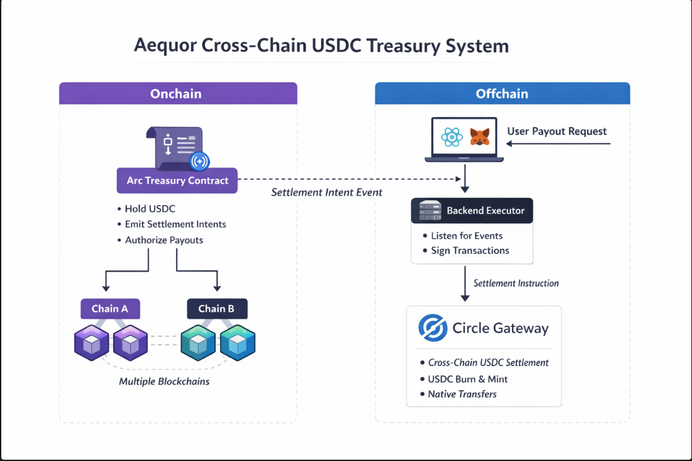

# Aequor

**Aequor** is a **chain-abstracted USDC treasury** that treats multiple blockchains as a single liquidity surface.  
It uses **Arc** as the onchain authority layer and **Circle Gateway** as the offchain settlement rail, allowing USDC to move across chains without exposing users to bridges, routing, or chain-specific complexity.


##  What is Aequor?

Managing USDC across multiple chains today requires bridges, chain selection, and fragmented UX.  
Aequor solves this by separating **authorization** from **execution**.

Users simply authorize a USDC payout from a shared treasury.  
Arc decides *when and where* USDC should move, and Circle Gateway handles *how* it gets there.

Chains become an implementation detail.


##  Bounty Submission

This project is submitted for the **“Best Chain Abstracted USDC Apps Using Arc as a Liquidity Hub”** bounty.

It demonstrates how Arc can act as a chain-agnostic authority layer for USDC while Circle infrastructure handles native cross-chain settlement.


##  Architecture



## How It Works 

### 1. Treasury Authorization (Arc)

- USDC is deposited into a Treasury smart contract on Arc.
- The Treasury enforces rules and emits intents.
- It does **not** bridge or settle funds directly.

### 2. Intent Emission

When a payout is authorized, the Treasury emits: 
`CrossChainSettlementRequested`,
This event represents **what should happen**, not **how it happens**.

### 3. Backend Executor

A Node.js backend:
- Listens for Arc settlement intents
- Determines an optimal destination chain based on system policy
- Calls Circle Gateway to settle USDC

### 4. Circle Gateway Settlement

Circle Gateway:
- Executes native USDC mint/burn via Circle infrastructure as part of settlement
- Abstracts cross-chain execution away from the application
- Removes bridge risk, slippage, and liquidity fragmentation

### 5. Frontend UX

A minimal React UI allows users to:
- Connect MetaMask
- Enter recipient and amount
- Click **Authorize USDC Payout**

No chain selection.  
No bridge UI.  
No routing decisions.


##  Tech Stack

| Layer | Technology |
|-----|-----------|
| Smart Contracts | Solidity, Hardhat, OpenZeppelin |
| Authority Layer | Arc |
| Settlement | Circle Gateway |
| Backend | Node.js, Express, ethers.js |
| Frontend | React, TypeScript, MetaMask |

## Repository Structure

```
aequor
├── contracts
│   ├── Treasury.sol
│   └── MockUSDC.sol
│   
├── scripts
│   ├── deploy.js
│   ├── deposit.js
│   ├── addRecipient.js
│   ├── executePayout.js
│   └── check-balance.js
│
├── backend
│   ├── index.js
│   ├── server.js
│   ├── circle.js
│   ├── TreasuryABI.json
│   └── package.json
│
├── frontend
│   ├── src
│   │   ├── App.tsx
│   │   ├── main.tsx
│   │   ├── config.ts
│   │   ├── styles.css
│   │   ├── components
│   │   ├── hooks
│   │   └── types
│   ├── index.html
│   ├── package.json
│   └── vite.config.ts
│
├── test
│   └── treasury.test.js
│
├── .env.example
├── package.json
├── hardhat.config.js
└── README.md
```


##  Setup & Environment

Create a `.env` file , copy and configure the content of `.env.example` into it.


##  Running the Project

### 1. Deploy Treasury

```bash
npx hardhat run scripts/deploy.js --network arcTestnet
```

### 2. Fund Treasury with USDC

```bash
npx hardhat run scripts/deposit.js --network arcTestnet
```

### 3. Start Backend API

```bash
cd backend
npm run server
```

### 4. Start Backend Executor

```bash
npm start
```

### 5. Run Frontend

```bash
cd frontend
npm run dev
```

Frontend runs at:

`http://localhost:5173`


##  Demo & Testnet Limitations

For hackathon and testnet purposes:

- Recipients are created per payout 
- Circle Gateway is used in testnet / simulated configuration
- Event listening depends on RPC provider support
- No bridges or DEXs are exposed to users

These limitations do **not** affect the core architecture and can be addressed later.


## Product Feedback & Learnings

Building Aequor highlighted several important insights about chain abstraction and treasury UX:

- Users do not want to think about chains, bridges, or routing — removing these choices significantly simplifies UX.
- Separating **authorization (onchain)** from **execution (offchain)** makes cross-chain systems easier to reason about and extend.
- Testnet infrastructure (RPCs, event indexing) is often the biggest bottleneck, not smart contract logic.
- Circle Gateway greatly reduces complexity compared to traditional bridge-based designs, especially for USDC-only flows.

If iterated further, user feedback would be incorporated to:
- Add clearer payout status tracking
- Support recurring payouts (payroll-like flows)
- Improve observability around settlement progress

##  Future Improvements

- Recipient caching
- Multi-sig treasury control
- Advanced routing logic
- Production Circle wallet management
- Real-time status updates
